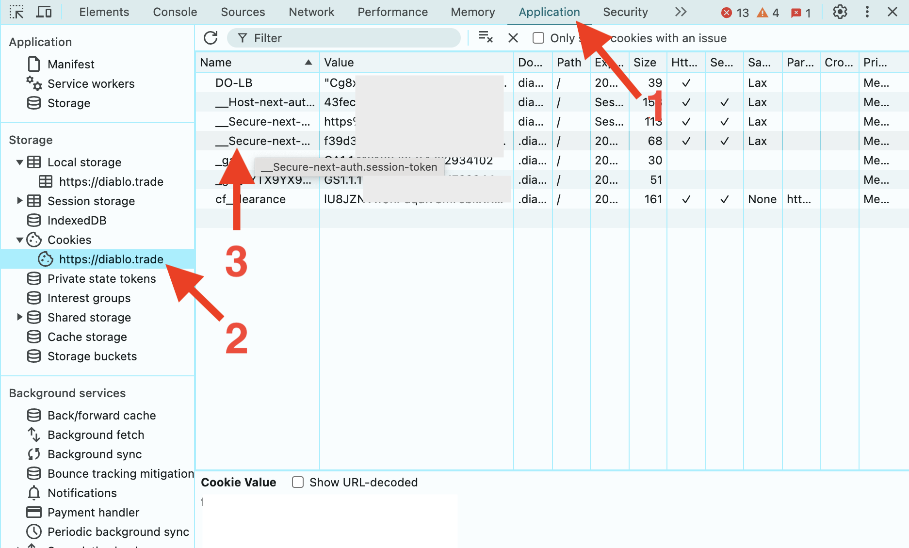

# Diablo Trade Notifier

[Русскоязычное README](https://github.com/TrayHard/diablo-trade-notifier/blob/main/README_RU.md)

This app allows you to get notifications about any new messages on the website for trading with in-game items and 
services in Diablo 4 - https://diablo.trade/. I made it for myself and now sharing it with others. For now it works only
with telegram, but Discord or any other method with API - can be attached as well. 

To use it you will have to install Python, create your Telegram bot, keep your PC turned on (or use a server) and around 
once a month reauthorize and update auth data in txt file, grabbing it manually from the browser (I'll show you how).

_A little disclaimer: I am not very familiar with Python, usually I work with JS, Python here been chosen only for interest and learning purposes,
so any recommendations in [Issues](https://github.com/TrayHard/diablo-trade-notifier/issues)
and [Pull Requests](https://github.com/TrayHard/diablo-trade-notifier/pulls) are welcome._

### Telegram:

### Usage:
- Install [Python 3](https://www.python.org/downloads/). 
- Clone the repo
- Install requirements: `pip install asyncio websockets requests python-dotenv curl_cffi`
- Create `.env` file and fill it up relying on `.env.example`
- Create "session_id.txt" file in the folder or just launch the app once, it will be created automatically.
- You need to grab your session id from browser and put it in "session_id.txt", to do that follow instructions in "**Authorizing**" section
- Launch the app. You should see something like this:

- Just leave it working, don't close it and you'll get notification once any new message will arrive on the website.
- Once a month you'll get an error message in telegram that your session id is expired
- To fix this just repeat the actions from **Authorizing** section

#### .env file
Firstly you need to create your own Telegram bot and put its secret token in .env file to allow the app operate using your bot. 
To do that just follow official tg instructions, they are pretty simple - https://core.telegram.org/bots/tutorial.

Then you need to get your telegram ID. To do that just use [@userinfobot](https://t.me/userinfobot), and put Id from there
to `"RECIPIENT_TG_ID"` environment variable in `.env` file

#### Authorizing
1. Open diablo.trade and authorize yourself
2. Open dev tools in your browser (Ctrl + Shift + I in Chrome)
3. Open "Application" tab there. Select "Cookies", domain "https://diablo.trade" and look for a cookie named `__Secure-next-auth.session-token`:

4. Grab its value by double clicking on it and copying its content
5. Paste it into `session_id.txt` file and launch the app.
