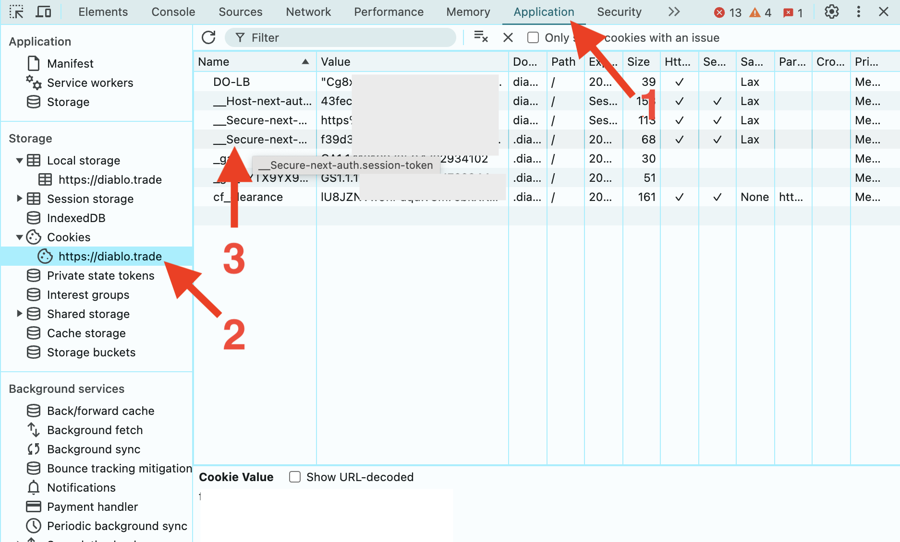

# Diablo Trade Notifier

[English README](https://github.com/TrayHard/diablo-trade-notifier/blob/main/README.md)

Это приложение позволяет получать уведомления о новых сообщениях на сайте для торговли внутриигровыми предметами и 
услугами в Diablo 4 - https://diablo.trade/. Я создал его для себя и теперь делюсь с другими. На данный момент оно 
работает только с Telegram, но можно подключить Discord или любой другой метод с использованием API.

Чтобы использовать его, вам нужно установить Python, создать своего Telegram-бота, держать компьютер включенным и раз 
в 1-2 дня перезапускать приложение, меняя данные аутентификации, вручную получая их из браузера (я покажу вам, как это
сделать).

_Небольшой дисклеймер: я не очень хорошо знаком с Python, обычно я работаю с JavaScript. Python был выбран для интереса и
целей обучения, поэтому любые рекомендации в [Issues](https://github.com/TrayHard/diablo-trade-notifier/issues)
и [Pull Requests](https://github.com/TrayHard/diablo-trade-notifier/pulls) приветствуются._

### Telegram:

### Usage:
- Установите [Python 3](https://www.python.org/downloads/).
- Склонируйте репозиторий
- Установите зависимости: `pip install asyncio websockets requests python-dotenv`
- Создайте файл `.env` и заполните его, опираясь на `.env.example`
- Создайте файл "session_id.txt" в папке, или просто запустите приложение один раз, файл будет создан автоматически.
- Вам нужно получить свой session id из браузера и поместить его в "session_id.txt". Для этого следуйте инструкциям в разделе "**Авторизация**".
- Запустите приложение. Вы должны увидеть что-то вроде этого:
  
- Просто оставьте его работать, не закрывайте, и вы получите уведомление, как только на сайте появится новое сообщение.
- 1-2 раза в день вы будете получать сообщение об ошибке в Telegram, что ваш токен истек:

- Чтобы исправить это, просто повторите действия из раздела **Авторизация**

#### .env file
Сначала вам нужно создать своего Telegram-бота и поместить его секретный токен в файл .env, чтобы приложение могло 
работать с использованием вашего бота. Для этого просто следуйте официальным инструкциям Telegram, они довольно просты -
https://core.telegram.org/bots/tutorial.

Затем вам нужно получить свой Telegram ID. Для этого просто используйте [@userinfobot](https://t.me/userinfobot) и 
поместите ID оттуда в переменную окружения `"RECIPIENT_TG_ID"` в файле `.env`.

#### Авторизация
1. Откройте diablo.trade и авторизуйтесь.
2. Откройте инструменты разработчика в вашем браузере (Ctrl + Shift + I в Chrome).
3. Перейдите на вкладку "Application". Выберите "Cookies", домен "https://diablo.trade" и найдите куки с именем `__Secure-next-auth.session-token`:

4. Скопируйте его значение, дважды щелкнув по нему и скопировав содержимое.
5. Вставьте его в файл `session_id.txt` и запустите приложение.

